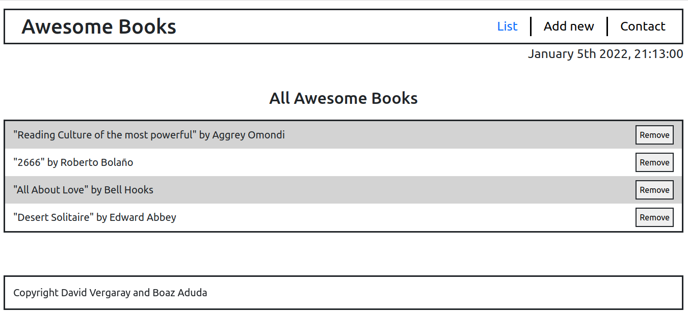
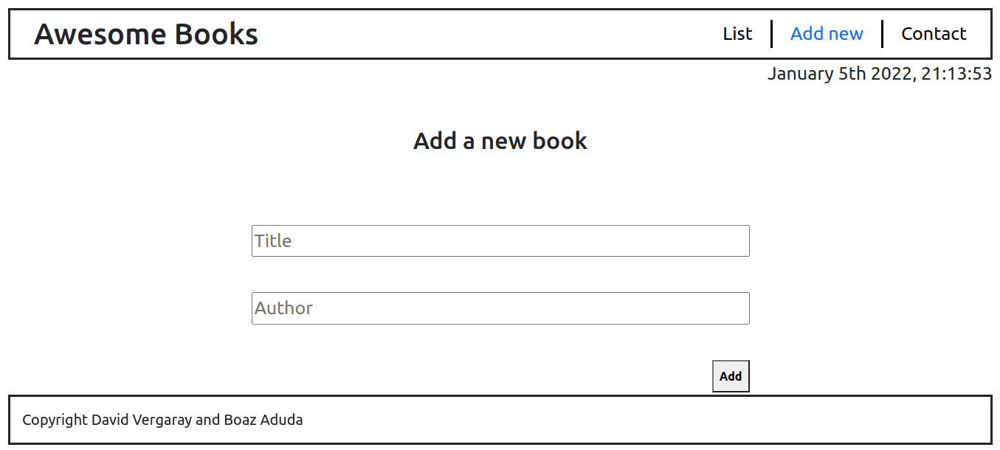
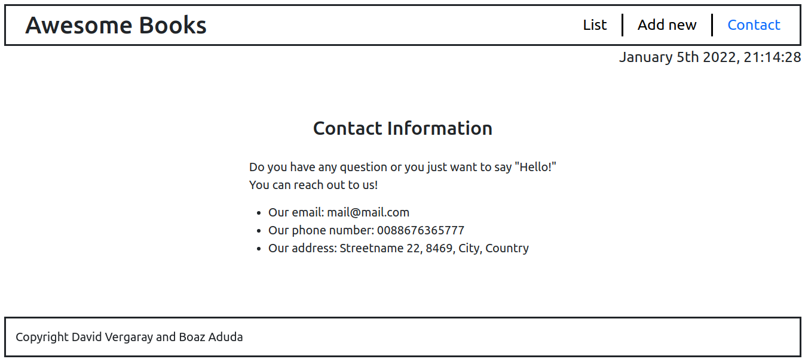

# Awesome books - project

> Project with the porpouse of learning Javacript.

Additional description about the project and its features.

## Built With

- HTML
- JavaScript
- CSS

## Live Demo

[Live Demo Link](https://yothu.github.io/awesome-books-project/)

## Authors

👤 David Vergaray

- GitHub:   [@Yothu](https://github.com/Yothu)
- Twiter:   [@Daivhy](https://twitter.com/Daivhy)
- LinkedIn: [David Vergaray](https://www.linkedin.com/in/david-vergaray-almontes-051a11127/)

👤 Boaz Aduda

- GitHub: [@Aduda-Boaz](https://github.com/githubhandle)
- Twitter: [@BoazAduda](https://twitter.com/BoazAduda)
- LinkedIn: [Boaz Aduda](https://www.linkedin.com/in/boaz-aduda/)

## 🤝 Contributing

Contributions, issues, and feature requests are welcome!

Feel free to check the [issues page](../../issues/).

## Show your support

Give a ⭐️ if you like this project!

## 📝 License

This project is [MIT](./MIT.md) licensed.
